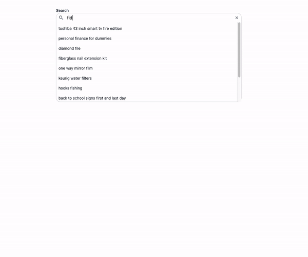

The dataset used in the project is the Amazon (US) top 1000000 search terms for 2021. The purpose of this project is to learn more about ElasticSearch and the Go programming language, so the code is probably not very idiomatic.

**Steps for running the app:**

Download https://www.kaggle.com/lividsu/amazon-search-terms-us-2021-jul/version/1 to `./backend/data`

`docker compose up`

`cd backend/data`

`go run import.go`

`cd ../backend`

`go run main.go`

cd into `./frontend`

run `npm i && npm run dev`

